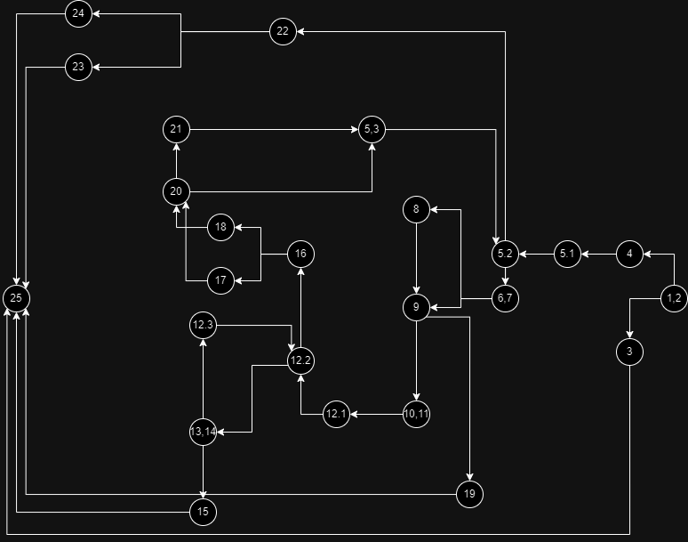

# SI_2024_lab2_223185

Stefan Sotirovski 223185

Цикломатската комплексност е 10, бидејќи бројот на предикати јазли во кодот е 9 (7 if услови и 2 for loops) и според формулата P+1, каде што P=9 го добиваме резулатот е 10.

